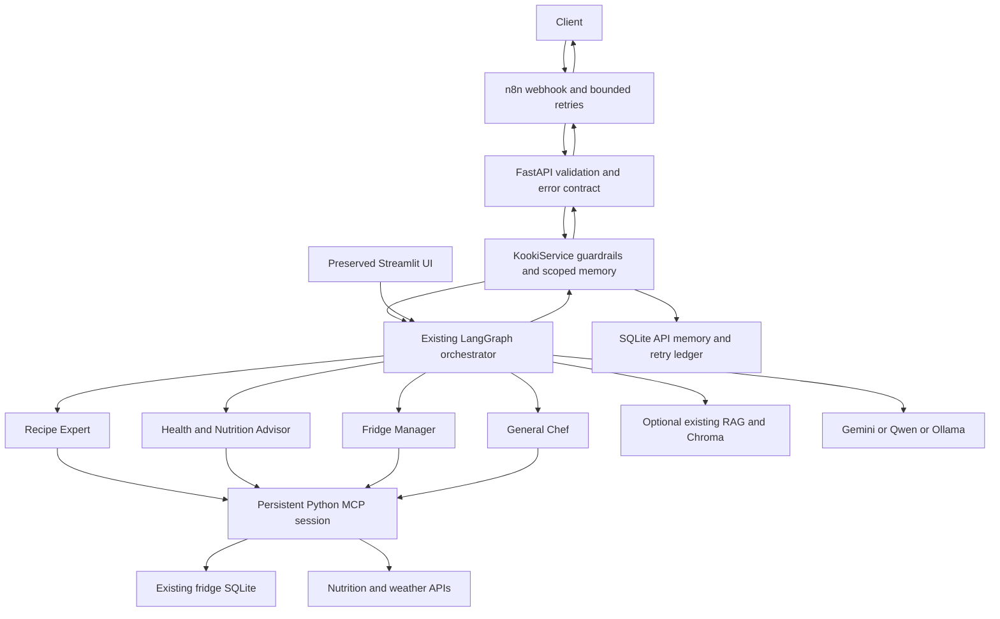

# Kooki: FastAPI and n8n, Phase 1

The AI brain remains the existing four-agent LangGraph. n8n handles incoming
business workflows and calls the HTTP API; it contains no AI Agent node.
No OpenAI API account or credit is required. See [the source audit](phase1-audit.md)
and [verification record](phase1-verification.md) for evidence and unverified work.

## Architecture and ownership

Before: Streamlit validates input, preclassifies with Qwen, and supplies intent
to LangGraph. The orchestrator respects that prefilled intent, so classification
was not executed twice. Streamlit still uses its existing initialization and
JSON session memory. Its full migration to the service is deferred.

After:



FastAPI owns the application lifespan: provider creation, persistent MCP session,
tool loading and graph building occur once per process. Shutdown closes the
session in the same lifespan task. The API uses explicit `client.session()` and
`load_mcp_tools()`: ordinary `get_tools()` adapters create a fresh session per
tool invocation. The legacy Streamlit loader retains that stateless behavior.
See the [official MCP adapter API](https://reference.langchain.com/python/langchain-mcp-adapters/tools/load_mcp_tools)
and [client implementation](https://github.com/langchain-ai/langchain-mcp-adapters/blob/main/langchain_mcp_adapters/client.py).

API requests are serialized in Phase 1 to protect the shared stdio connection
and session chronology. Run **one worker**. No production authentication system
is included. `user_id` is supplied by a trusted caller, not an authenticated
identity. Keep this API on localhost or a private trusted network. A public
gateway must authenticate callers and bind their user identity before use.

## Installation and provider configuration

Use Python 3.10+ from the repository root:

```powershell
python -m venv .venv
.venv\Scripts\Activate.ps1
python -m pip install -r requirements-dev.txt
Copy-Item .env.example .env
```

Edit `.env` privately. Existing AI dependency floors are preserved; a complete
dependency lock is deferred. Do not commit `.env`, databases, or session files.

| Variable | Purpose |
|---|---|
| `KOOKI_PROVIDER` | `gemini`, `qwen`, `ollama`; blank follows YAML: local, then Gemini, then Qwen |
| `GEMINI_API_KEY` | Needed only for Gemini |
| `DASHSCOPE_API_KEY` | Needed for Qwen and optional existing RAG |
| `SPOONACULAR_API_KEY` | Optional nutrition lookup; built-in fallback exists |
| `KOOKI_OLLAMA_MODEL` | Local model name, default `qwen2.5:7b` |
| `KOOKI_OLLAMA_BASE_URL` | Ollama URL, default `http://localhost:11434` |
| `KOOKI_ENABLE_RAG` | Defaults to `false`; `true` enables shared cloud-backed RAG |
| `KOOKI_API_DB_PATH` | Optional durable API memory/ledger path; default `data/kooki_api.db` |

`KOOKI_PROVIDER` overrides **the API**. Streamlit continues to select its provider
using `conf/agent_config.yaml`. API routing and safety judging use the initialized
chosen model asynchronously. Existing Streamlit routing and safety judging still
use Qwen. RAG uses DashScope embeddings, rewriting and reflection even when the
main model is Ollama or Gemini. Vision/audio also depend on DashScope.

For local API text development, run Ollama with a model supporting tool calling,
set `KOOKI_PROVIDER=ollama` and `KOOKI_ENABLE_RAG=false`. No cloud LLM key is then
required by the API text path. Weather and optional nutrition tools still access
external services; this is not a claim that every feature is offline.

## Start and health

```powershell
python -m uvicorn api.app:app --host 127.0.0.1 --port 8000 --workers 1
curl.exe http://127.0.0.1:8000/api/health
```

Ready health returns HTTP 200:

```json
{"status":"ok","service":"kooki-api","agent_graph_ready":true,"mcp_ready":true,"provider":"gemini"}
```

Startup failure leaves a degraded app available for diagnostics: health returns
HTTP 503 with false readiness flags and chat returns a normalized error. Health
indicates initialization, not a continuous provider connectivity probe. Startup
has no MCP connection timeout yet; apply a supervisor startup deadline. No graph
or MCP process is rebuilt for individual HTTP calls.

## Chat contract

```json
{
  "user_id":"user_001",
  "session_id":"session_001",
  "message":"Recommend dinner using my fridge.",
  "metadata":{"city":"Tunis","channel":"n8n"},
  "idempotency_key":"dinner-001"
}
```

IDs and optional keys: 1–128 ASCII letters, digits, underscores or hyphens,
starting with a letter or digit. Message: nonblank, maximum 8000 characters.
Metadata: JSON object, maximum 4096 UTF-8 bytes. Extra top-level fields are rejected.
Metadata reaches execution context and graph state; `city` does not currently
automatically override the weather tool's city argument.

PowerShell example (file input avoids shell-dependent quoting):

```powershell
@'
{"user_id":"user_001","session_id":"session_001","message":"Recommend dinner using my fridge.","metadata":{"city":"Tunis","channel":"n8n"},"idempotency_key":"dinner-001"}
'@ | Set-Content -Encoding utf8 request.json
curl.exe -H "Content-Type: application/json" --data-binary "@request.json" http://127.0.0.1:8000/api/chat
```

Success (HTTP 200): `status`, `execution_id`, `intent`, `selected_agent`, `response`,
`tools_used`, `warnings`, `rag_sources`, `execution_time_ms`. Intent and selected
agent are null if unavailable. Tool names and warning tags are collected from
request-scoped middleware. `rag_sources` is currently always empty: the existing
RAG tool returns prose without reliable source records. Timing excludes queue
waiting. Replayed results preserve their original execution ID and timing.

Errors have only `status`, `execution_id`, `error_type`, public `message`, and
`retryable`. There are no client stack traces or raw SDK/tool errors. Server logs
record execution ID, stage and exception class without messages, tool arguments,
or output previews. Environment credential values are redacted by the formatter.

| Error | HTTP | Default retry before graph execution |
|---|---:|---|
| VALIDATION_ERROR | 422 | No |
| MODEL_TEMPORARILY_UNAVAILABLE | 503 | Yes |
| MODEL_RATE_LIMITED | 429 | Yes |
| MODEL_CONFIGURATION_ERROR | 503 | No |
| MCP_UNAVAILABLE | 503 | Yes |
| TOOL_EXECUTION_ERROR | 502 | No |
| RAG_UNAVAILABLE | 503 | Yes |
| DATABASE_ERROR | 503 | No |
| INTERNAL_ERROR | 500 | No |
| SAFETY_BLOCKED | 400 | No |
| IDEMPOTENCY_CONFLICT | 409 | No |
| IDEMPOTENCY_IN_PROGRESS | 409 | No |

**All failures after graph entry are non-retryable**, because a tool may already
have executed. Unknown SDK exceptions conservatively normalize to INTERNAL_ERROR.
n8n adds `API_TRANSPORT_ERROR` at its own boundary when a response cannot be read.

## Guardrails, scope and side effects

Validation precedes input PII redaction and safety judging, graph execution,
output redaction, atomic memory/response persistence, then HTTP response.
The API safety judge fails closed on malformed or unavailable judgments. Existing
regex redaction covers emails and selected phone/ID/card patterns, not all PII.
This is not a medical safety guarantee. Streamlit now buffers and redacts final
text before displaying it; its complete live behavior still needs runtime testing.

Memory uses `(user_id, session_id)` keys in a separate SQLite store. No default
configured user is used by API tools: trusted wrappers overwrite model-supplied
user IDs. Remove/clear tools accept explicit user IDs while retaining legacy
fallbacks. Global warning state was replaced by `ContextVar` execution state.

The API allowlist excludes ordering, filesystem tools and unknown tools. Shared
`local_privacy/` has no user isolation. Existing RAG is also shared; enabling it
assumes a trusted shared knowledge base. Streamlit retains its filesystem MCP,
vision/audio, ordering demonstration and existing session flow.

A durable retry key is scoped to user+session. An identical completed request
replays its sanitized result. Reusing a key with different message/metadata gives
409. Reservations surviving a crash stay blocked for manual reconciliation; no
automatic expiry replays potentially completed side effects. Writes to fridge
inventory require a key. Keep the same key when retrying a delivery, and generate
a new key for a genuinely new message. This prevents request re-execution; it does
not guarantee that a model calls a mutating tool only once inside one graph run.
Ordering is disabled on this API rather than relying on that weaker guarantee.
Retain the SQLite file across restarts. Do not share the same database between
multiple workers as a substitute for a distributed session scheduler.

## Streamlit

```powershell
python -m streamlit run web/app_ui.py
```

Use its existing YAML provider flags and Node/npm for the legacy filesystem MCP.
API-only text uses the Python MCP server and does not require Node. The legacy
Streamlit session manager and provider selection have not been migrated to
KookiService. Its Qwen-based auxiliary calls remain a limitation of local mode.

## Import and configure n8n

1. Import `n8n/workflows/kooki_chat.json` from a file in the n8n editor.
2. Edit the **Set Execution Context** Code node's non-secret `base_url` for your network.
3. Leave the workflow inactive while testing; select **Listen for test event**
   on the webhook and send the same chat JSON to its displayed test URL.
4. Check the returned success/error and the three HTTP attempt nodes. Backoff is
   2 seconds then 4 seconds, maximum three total attempts. Non-retryable errors stop.
5. Activate only after a real import and end-to-end run succeed on your installation.

The first Code node generates `n8n-${execution.id}` when no caller key exists.
That key stays stable across the three attempts. Separate webhook deliveries or
manual execution replays receive a different execution ID: the original client
must supply a stable key to deduplicate those deliveries. Each HTTP node references
the original context payload, not the previous response.

There are no exported credentials. Model credentials stay in the API's private
environment. The Phase 1 local API has no authentication credential. Protect the
n8n webhook using n8n credentials and a trusted gateway if exposing it externally;
configure secrets inside n8n, not in this JSON. Stored n8n executions may contain
chat input/output: configure execution retention and access appropriately.

HTTP Request uses documented JSON body, full response and Never Error options;
network failures continue to the response assessment node. Responses go through
Respond to Webhook with the matching HTTP status. Node parameters were checked
against official documentation and source. No n8n instance/MCP was available, so
actual import/execution has **not** been verified. See
[HTTP Request](https://docs.n8n.io/integrations/builtin/core-nodes/n8n-nodes-base.httprequest/),
[Respond to Webhook](https://docs.n8n.io/integrations/builtin/core-nodes/n8n-nodes-base.respondtowebhook/),
and [Wait](https://docs.n8n.io/integrations/builtin/core-nodes/n8n-nodes-base.wait/).

## Local network and Docker

| n8n/API location | base_url |
|---|---|
| Both native on the same PC | `http://127.0.0.1:8000` |
| n8n in Docker Desktop, API native Windows | `http://host.docker.internal:8000` |
| Both containers on a private Compose network | API service DNS, e.g. `http://kooki-api:8000` |
| n8n Cloud | A securely authenticated reachable endpoint; localhost cannot work |

For Docker Desktop to reach a native API, bind the API to an interface reachable
from Docker, typically `--host 0.0.0.0`, and limit firewall access to trusted local
traffic. Do not expose this unauthenticated service publicly. Within a container,
`localhost` refers to that container. Linux Docker may need an explicit host-gateway
mapping. Persist API/fridge SQLite and optional Chroma storage as volumes. No Docker
deployment infrastructure is added in this phase. Existing `vercel.json` is not a
verified deployment for this long-lived stdio/SQLite service.

## Tests and limitations

```powershell
python -m pytest -q
node tests/workflow_codes.cjs
python -m compileall -q api services agent web utils tests
git diff --check
git status --short
```

The API tests use actual FastAPI/Pydantic/SQLite with injected fake model/graph/tool
boundaries. Graph smoke tests use real LangGraph/LangChain plus a local fake model,
and explicitly skip if the AI dependency stack is absent. Code-node tests run the
exported JavaScript under Node; they do not simulate the n8n engine. No tests call
paid models. See the exact executed results in [verification](phase1-verification.md).

Outstanding: full dependency installation and real model/MCP/Streamlit smoke run;
n8n import and test webhook; provider-specific timeout/error mapping; MCP reconnect
and startup deadlines; request cancellation; bounded queues; retention/encryption;
authentication and user binding; optional RAG isolation and citations; legacy
session manager hardening. QLoRA is untouched. Phase 2 should address these before
adding scheduled alerts, notification channels, vision/audio workflows or deployment.
